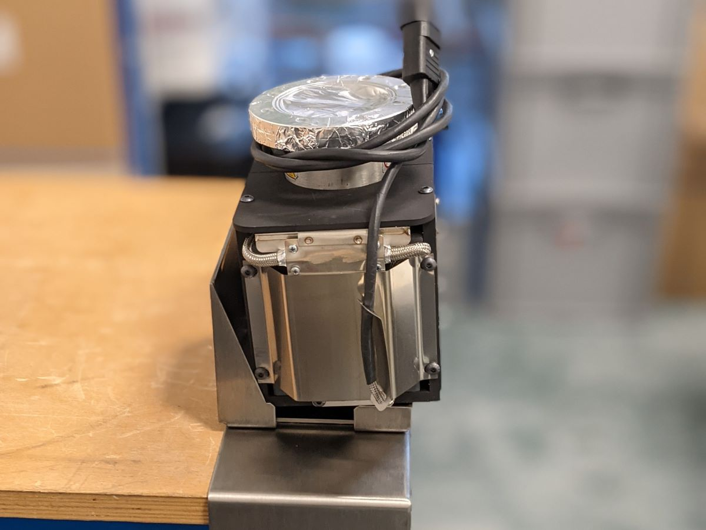

Sometimes the goalposts move. Projects involve lots of people from different areas of the business each with their own priorities and ideas for how best to progress. Sometimes things change last minute and sometimes new information comes to light only after time and work have been invested.

Specifically, I am referring to a recent Jig I designed whose concept was okayed, drawings approved, and dimensions four-eyes checked, only to find that when it was put to test in production the Jig was the wrong size.

{: .align-center}

It turns out the component that the Jig was designed for was arriving into production with an extra part fitted to the sides, a change that had only been requested after I had begun designing the Jig. I was working off of information that had become obsolete.

Thankfully, in the future there is a very simple fix. First discuss the requirements with the project lead like normal, then go and discuss them with the production technicians directly. They are the ones who use the components daily and who have an intimate knowledge of any past or future changes affecting them.

This time around the Jig in question was only a prototype, so the cost of this mistake wasn't major, but it served as a great tool for learning how better to approach projects like this in the future.

Want to see Version 2 of the Jig? Check out my [portfolio page](/portfolio/Ion Pump Clamping Jig/) all about the final product.

### Lessons Learned

- Sometimes the goalposts move and it isn't a big deal
- Involve the technicians who will work directly with the jig, even if they aren't the main authority. Sometimes they know something that everyone else doesn't.

***
