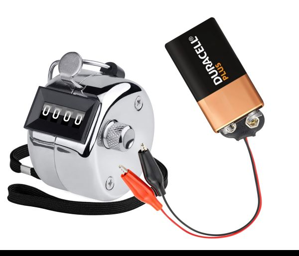
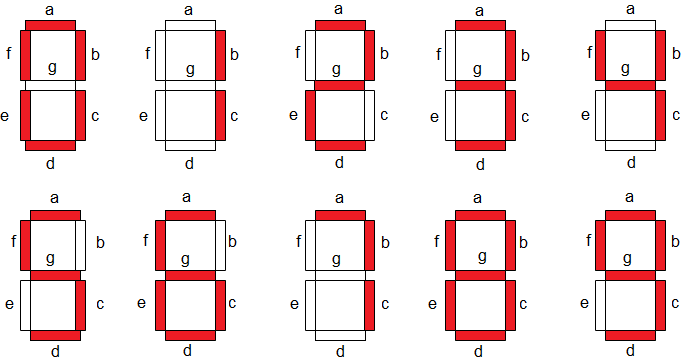
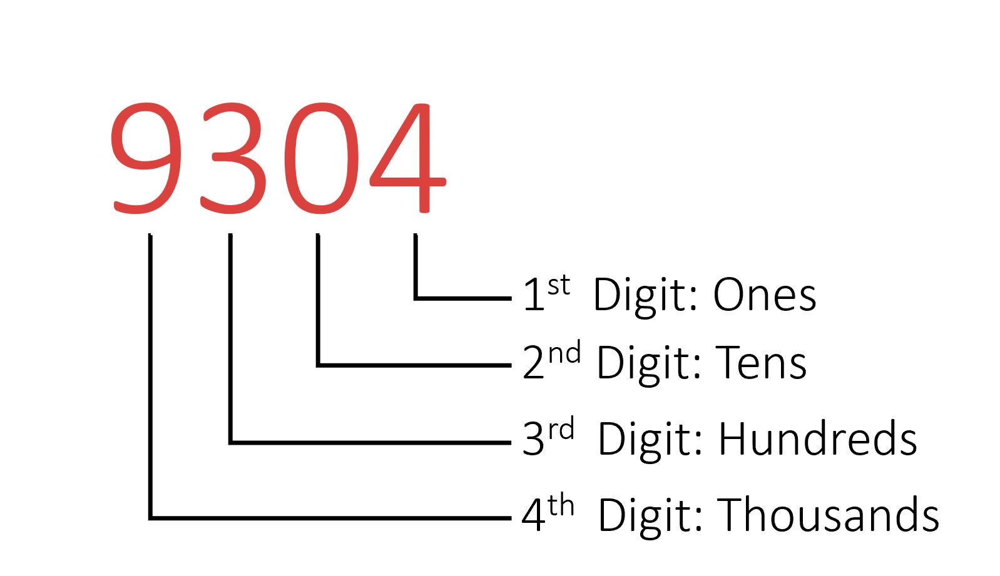
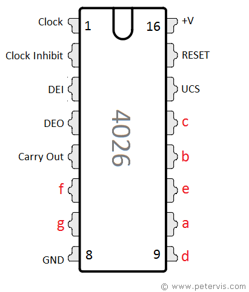
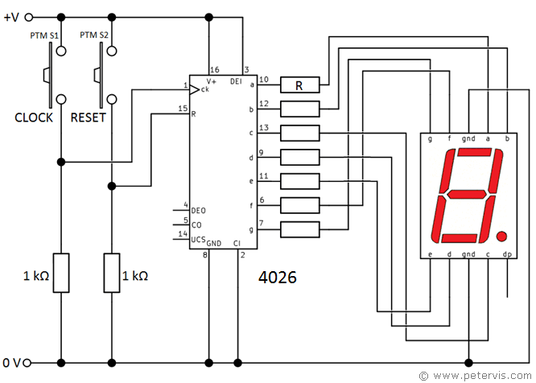

It’s time to undertake a raw unadulterated electronics project, one where I don't use code, using common off-the-shelf IC chips bent to my whim to perform a task. Obviously, IC chips exist for all sorts of applications, so there won't be much 'bending', but it will give me a chance to dive deeper into electronic circuitry and understand what goes into developing it.

It’s January, so why not make a digital counter to keep a tally of how many days I have stuck to my new years resolution. Every time I push the button, it adds 1 to the count. The code for something like this would be simple, you can probably find it packaged up as an introduction-to-Arduino kit somewhere, but restricting the project to off-the-shelf components is going to require me to do some research and stretch my electronics knowledge.

{: .align-center width="500px"}

A simple search for "counter IC chips" brought up an array of options, amongst which was the IC4026, a decade counter that doubles as a 7seg display driver. A decade counter is one which counts in human-friendly digits, 0-9, rather than binary, the IC4026 then takes this one step further and displays it to the world by converting the digit into the 7 outputs required to light up a seven-segment (7seg) display, perfect!

{: .align-center width="500px"}

Typically, the IC4026 is paired with a timing chip to make a clock. Instead, if we swap out the 'clock' pulse for a 'button' pulse, we get the behaviour we are looking for.

A 7seg display can only display one-digit numbers (0 to 9), as can the IC4026, any additional pulses roll the count back over to 0. That's not very useful on its own, so the IC4026 includes an additional pin which sends a pulse every time the count rolls over, known as the 'cascade' pin. If you fed this pulse into a second IC4026, you can now count an extra digit, or in other words, you can now count 'tens' as well as 'ones', allowing you to display values up to 99.

{: .align-center width="300px"}

## Circuit/Schematic

{: .align-center width="300px"}

{: .align-center width="500px"}

{: .align-center width="500px"}
## Conclusion

The IC4026/7seg combo does exactly what I need, so the plan is to multiply it by 4 to give me a counter which can go all the way up to 9999. The current circuit, however, is proving to be very sensitive to input pulses and the [bounce within the button](https://www.programmingelectronics.com/debouncing-a-button-with-arduino/) is causing the counter to register additional inputs.

Next, I need to look at ways to debounce a button using hardware.

## Resources
- Schematic + Explanation:  [https://www.petervis.com/GCSE_Design_and_Technology_Electronic_Products/4026-counter-circuits/4026-counter-circuit.html](https://www.petervis.com/GCSE_Design_and_Technology_Electronic_Products/4026-counter-circuits/4026-counter-circuit.html)
- Datasheet:  
    [https://www.ti.com/lit/ds/symlink/cd4026b.pdf](https://www.ti.com/lit/ds/symlink/cd4026b.pdf)

***