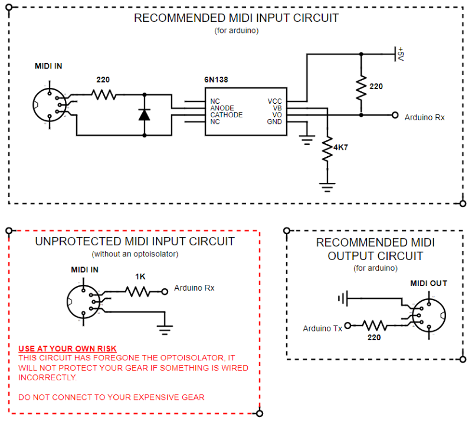

I DO NOT, I REPEAT, **DO NOT CONDONE** THE USE OF A MIDI INPUT CIRCUIT WHICH DOESN'T INCLUDE AN OPTOISOLATOR (such as the 6N137 / 6N138 / 6N139 chips)

...But I'm not saying it isn't useful.

Technically, you don't need an optoisolator for a MIDI Input circuit to work, all you need is a single resistor and it will receive MIDI messages just fine. This version of the circuit, however, offers absolutely zero protection for your expensive music gear, opening it up to a world of pain from potential ground loops or reversed polarity. You are likely to introduce an audible hum too, as an ever-present reminder of the ground loop you have now introduced and the unprotected comms you are partaking in.

Because of this lack of protection, I tend to only use this version of the circuit during the early stages of prototyping when I am only risking an Arduino and potentially a USB MIDI Interface. I wouldn't dare plug it into a several-hundred-pound instrument.

So, I can do nothing more to recommend that you 110% never ever forever never use this circuit and instead use one of the many versions outlined online or [here](/midi-input-with-6n137-6n138-or-6n139/) ... but here is the schematic anyway, next to the actual recommended circuits in case you change your mind.

Do harm with this information as you will.

{: .align-center}
***
