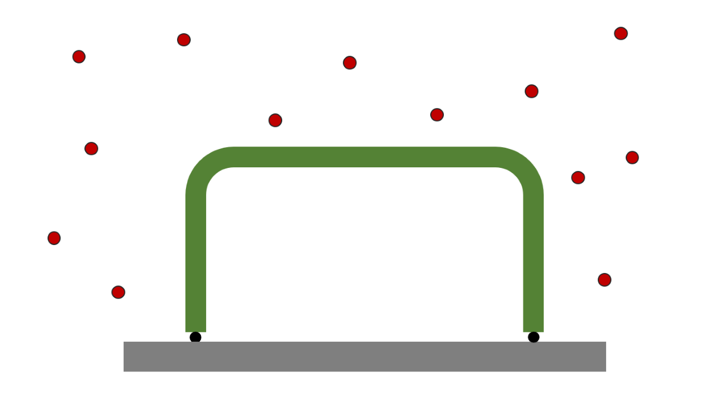
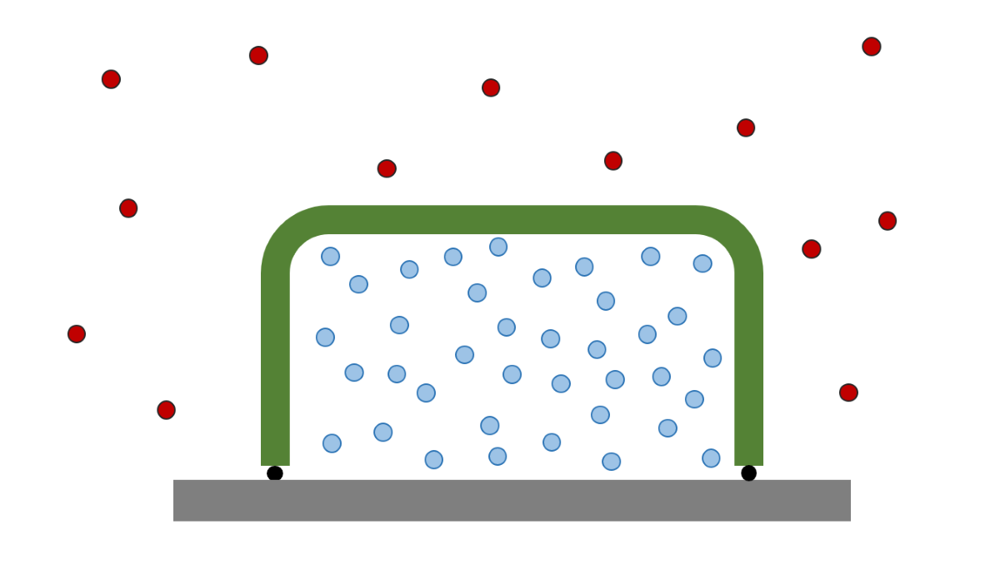

If you had to ship a system that needs to be immaculately clean, so clean that even the air needs to be removed (such an [Ultra High Vacuum Chamber](https://en.wikipedia.org/wiki/Ultra-high_vacuum)), how would you do it? How would you ensure that all your hard work and efforts spent cleaning the internals don't go to waste? If your first thought was to suck out all the air inside and place it under a vacuum then good news, you are normal, but also kind of wrong.

Counterintuitively, they are pumped up with positive pressure instead.

Now, I’m not saying you couldn’t place it under a vacuum, seal it all up, and FedEx it halfway across the world, that would work wonderfully, it just isn’t what we do. To understand the seemingly backwards logic we need to run a few scenarios:

### Scenario 1: Vacuum

You clean the system, suck out all of the air, seal it up and ship it over to its destination. It arrives to the customer sealed and free from contamination. Great, now they can open that sucker up and get straight to work.

{: .align-center width="400px"}
Figure: System under a vacuum, no contamination present

### Scenario 2: Pressurised

You clean the system just the same, but this time instead of sucking out the air you fill the system with nitrogen. It arrives to the customer sealed and free from contamination but before they can use it they need to open it up and vent out all of the nitrogen. It is an additional step, but you’ll see why it is worth it.

{: .align-center width="400px"}
Figure: System filled with pressurised Nitrogen, no contamination present
### Scenario 3: Vacuum Leak

As before, you clean the system and suck out all of the air, but this time it springs a leak on its way to the customer. Air from the atmosphere is sucked into your vessel by the low pressure of the vacuum and all your hard work is ruined. The system arrives at the customer contaminated by the dirty air.

.png){: .align-center width="400px"}
Figure: Leak has resulted in contaminated air being sucked into the system

### Scenario 4: Pressurised Leak

You clean the system and pump it full of nitrogen. This time if it leaks no outside air is sucked in, instead the pressurised nitrogen leaks out until the pressure inside the system has equalised with the atmospheric pressure, leaving the system clean and the customer happy.

.png){: .align-center width="400px"}
Figure: Nitrogen has leaked out, but no contamination has entered the system

The potential for contamination outweighs the fairly minor effort of venting the nitrogen, and that is why vacuum systems are typically shipped in a positive pressure state.

***