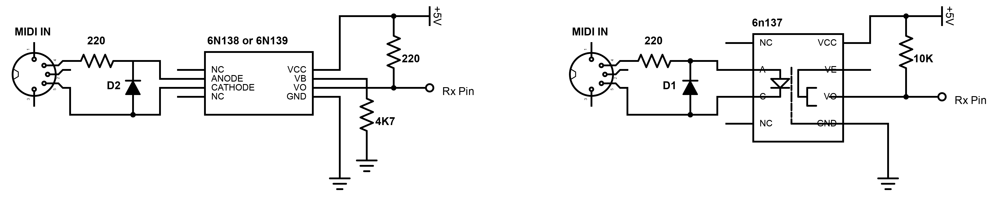

.png){: .align-center}
Figure: MIDI Connection Specification as outlined by the [MIDI Association](https://www.midi.org/specifications-old/item/midi-din-electrical-specification)

If you take a look at the schematic for the MIDI Input circuit you will notice that it includes an optoisolator (or optocoupler, depending on how you say it), the 6N138. Whilst not strictly necessary for operation, it is there to protect your expensive music gear if something is wired incorrectly. But what if you only have access to a 6N137 chip, or a 6N139? They are still optoisolators, but there isn’t much mention of them when it comes to music gear. The short answer is yes, but there are a few differences in how they are wired up.

{: .align-center}
Figure: Circuit diagrams side by side (6N138/9 and 6N137)

There are only two differences in the circuits:

1. The value of the pullup resistor (from VCC to VO)
    
2. The inclusion of a base bypass resistor (from pin 7 to ground)
    

That is all you need to know to adjust your modular synthesiser circuit to use any of the three optoisolators. If you’re focusing on a different application there are some deeper differences that I won’t go into here (eg. The 6N137 can operate at a much faster transfer rate of 10 MBaud/s), but [this article](https://hackaday.com/2018/05/09/optocouplers-defending-your-microcontroller-midi-and-a-hot-tip-for-speed/) break it down well.

## Why are the circuits different anyway?

It comes down to the internals of the optoisolators themselves. The 6N138 and 6N139 use a combination of two transistors in a Darlington Configuration, whereas the 6N137 uses a NAND logic gate to achieve the same output. Because the NAND gate operates at CMOS voltage level, it doesn't require as much current to flow through its pullup resistor (so its value increases to 10K) and the NAND gate doesn’t require the [base bypass resistor](https://electronics.stackexchange.com/questions/288448/minimize-current-consulption-for-midi-input-circuit/288481#288481) because pin 7 has now become an 'enable' pin instead (LOW = Disabled, by creating an AND condition).

.png)
**6N138 & 6N139**  (Darlington Transistors)

.png)
**6N137** (NAND Gate)

## Why do I even need one?

What does the optoisolator actually do? It isolates and protects your music gear from whatever is plugged into it, but from what? Well, by ensuring that the two pieces of gear are electrically separated from each other we ensure that the grounds of your two aren’t connected, removing the risk of a [ground loop](https://hackaday.com/2017/03/09/wtf-are-ground-loops/) that could cause an audible hum or even redirect the electronic signals down a new path to ground which could reek all sorts of havoc to both pieces of gear.  

Whilst we are talking about protection, let's talk about the diode too. That is there to protect the optoisolator itself in an event where a MIDI cable with the wrong polarity is connected. It has a forward voltage of 0.7v which, as pointed out by ‘etXzat’ in the comments, drops limits the backward voltage across the optoisolator’s led to 4.3V a matching 0.7V, aka low enough not to blow it, once again saving your expensive music gear.

-v2.png){: .align-center}
Figure: How the Diode protects the optoisolator’s internal LED

### Sources

- 6N138/9 Datasheet  
    [http://i2c2p.twibright.com/datasheet/6n139.pdf](http://i2c2p.twibright.com/datasheet/6n139.pdf)
    
- 6N137 Datasheet  
    [https://www.vishay.com/docs/84732/6n137.pdf](https://www.vishay.com/docs/84732/6n137.pdf)
    
- Circuit Diagram for MIDI Input using 6N137  
    [https://hackaday.com/tag/6n137/](https://hackaday.com/tag/6n137/)
    
- Cer_Visia’s comment on a reddit thread regarding these three optocouplers  
    [https://www.reddit.com/r/AskElectronics/comments/ci4b8e/comment/ev1lgpf/?utm_source=share&utm_medium=web2x&context=3](https://www.reddit.com/r/AskElectronics/comments/ci4b8e/comment/ev1lgpf/?context=3&utm_medium=web2x&utm_source=share)
    
- CL.’s response regarding MIDI current consumption and the reason why the 6N138/9 requires a base bypass resistor  
    [https://electronics.stackexchange.com/questions/288448/minimize-current-consulption-for-midi-input-circuit/288481#288481](https://electronics.stackexchange.com/questions/288448/minimize-current-consulption-for-midi-input-circuit/288481#288481)
    
- Video Series by Notes & Volts introducing the MIDI Connection and how to utilise it with Arduino  
    [https://www.youtube.com/watch?v=0L7WAMFWSgY&list=PL4_gPbvyebyH2xfPXePHtx8gK5zPBrVkg](https://www.youtube.com/watch?list=PL4_gPbvyebyH2xfPXePHtx8gK5zPBrVkg&v=0L7WAMFWSgY)
    
- OPTOCOUPLERS: DEFENDING YOUR MICROCONTROLLER, MIDI, AND A HOT TIP FOR SPEED  
    [https://hackaday.com/2018/05/09/optocouplers-defending-your-microcontroller-midi-and-a-hot-tip-for-speed/](https://hackaday.com/2018/05/09/optocouplers-defending-your-microcontroller-midi-and-a-hot-tip-for-speed/)
    
- The MIDI Associations page on the MIDI Connection Specifications  
    [https://www.midi.org/specifications-old/item/midi-din-electrical-specification](https://www.midi.org/specifications-old/item/midi-din-electrical-specification)
    
- WTF Are Ground Loops?  
    [https://hackaday.com/2017/03/09/wtf-are-ground-loops/](https://hackaday.com/2017/03/09/wtf-are-ground-loops/)

## Edits

1. In “Figure: How the Diode protects the optoisolator’s internal LED”, changed forward voltage across optoisolator LED from 4.3V to 0.7V, as per ‘etXzat's’ comment (17-Nov-2023)

***