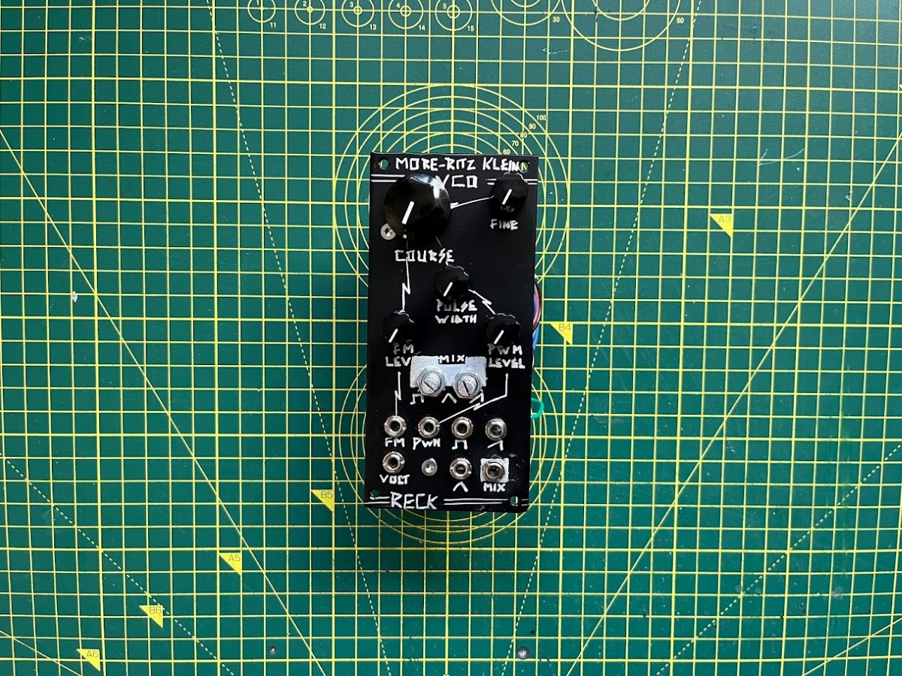
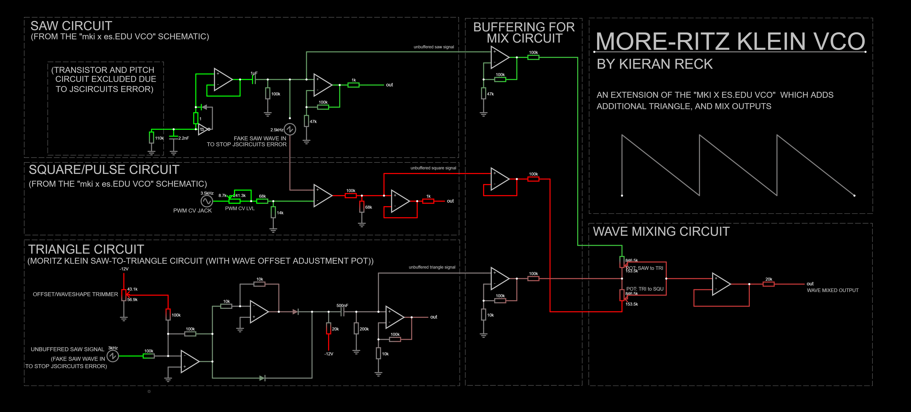
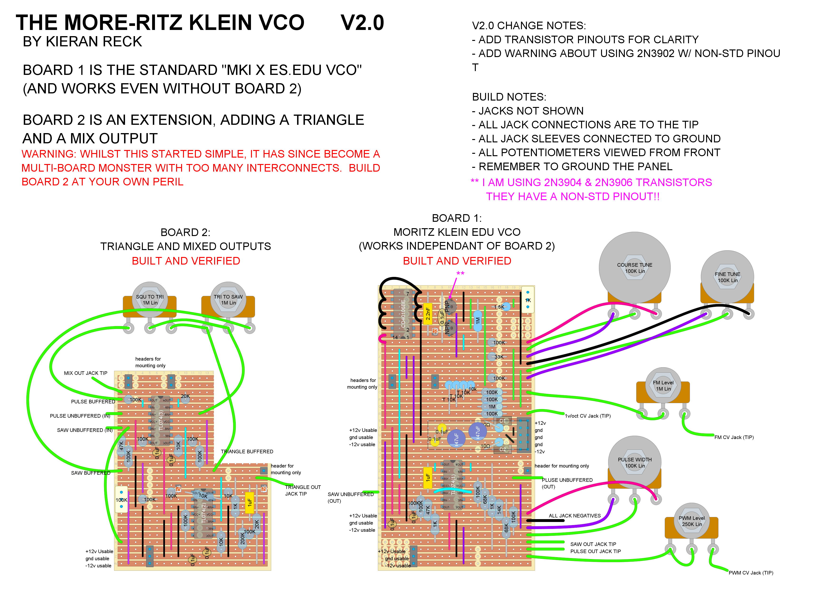
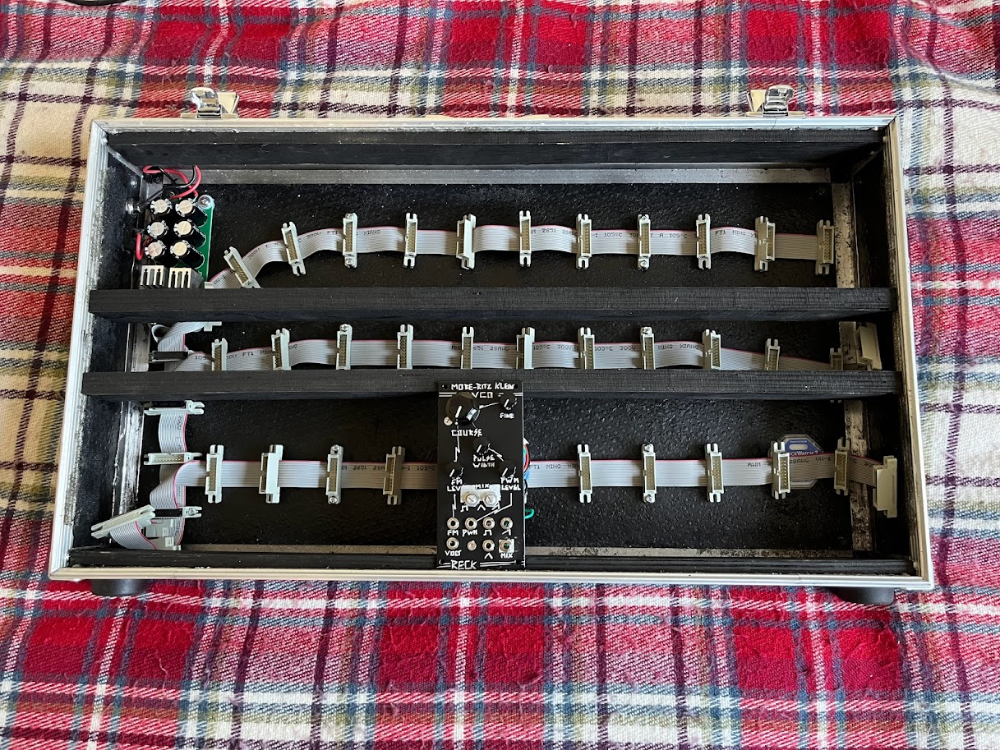

The More-ritz Klein VCO, it's the Moritz VCO, with more! What more? More Moritz of course. I have combined the mki x es.EDU VCO module with Moritz's additional triangle wave circuit and added flavour with a mixed output that combines all three waveforms to create complex sonic goodness.

# Dimensions

Width: 12 HP

Depth: 50mm (Board 1 & 2 stripboard)

Depth: 40mm (Board 1 stripboard)

# Features

The base of this module is the [mki x es.EDU VCO](https://www.ericasynths.lv/shop/diy-kits-1/edu-diy-vco/), to which I owe **ALL** of my understanding. Seriously, if you haven't checked out the free manuals provided on the sales pages for these modules then you are missing out. Moritz has a knack for explaining the complexities of electrical circuits, all from a synth design perspective and the 20+ page document details every decision made to go from the most basic concept, all the way to a fully-fledged module.

.png)

In addition, to the Saw and Square waves of the EDU VCO, I have added a Saw-to-Triangle conversion circuit which also came from a [Moritz Klein Video](https://www.youtube.com/watch?v=4r3TTaUKNe0). This circuit includes a wave offset trimming pot to tune your triangle to smooth melodic perfection.

Lastly, I added a Wave Mixing circuit which allows you to blend all three waveforms. Where did I get this circuit? You guessed it, from another of Moritz's videos, this time extracted from the schematic for the [Moritz Klein Shapes VCO](https://www.youtube.com/watch?v=OCAb2UoSPs0). I have to admit, this last circuit was a touch too complex to add as part of a stripboard build, but when I originally planned it I had missed out a whole Op Amp chip and therefore was lulled into a false sense of simplicity! It would have been simpler to design a PCB instead, but I had already built the majority of the stripboard by the time I noticed.

# Schematic

Falstad JSCircuit Simulation can be found here: [https://tinyurl.com/228fq3w4](https://tinyurl.com/228fq3w4)

Note: The pitch control section of the mki x es.EDU VCO schematic (anything from the transistors back to the tuning knobs) was excluded from the simulation because it breaks the circuit for some unknown convergence reason. This section of the circuit is a voltage divider which causes the transistor to act as a variable resistor, so the simulation has a resistor with an adjustable slider for all of your pitch control needs. If you build the circuit, here is the stuff you are missing, just replace the first resistor (110k) in the saw schematic with the stuff below:

.png)

# Stripboard Layout

I have mentioned it already, but the full circuit was a little too complex as a stripboard build. Board 1, however, is a good build and doesn't require Board 2 to work!

- Board 1 is everything you need to build the base 'mki x es.EDU VCO', all within a single 12 HP board, just 2 HP wider than the PCB project.
- Board 2 is the 'Extension Board', this is where the build becomes cumbersome. This board contains the Triangle circuitry, as well as the Wavemixing circuitry.

WARNING - In this layout I am using the 2N3904 NPN and 2N3906 PNP transistors. These have a non-standard pintout (with the E and C pins swapped). Double check your chosen transistors to confirm orientation.
{: .notice--warning}

<figure class="half">
    
    
</figure>

# Lessons Learned

Usually, I like to use this section for small, niche things that I learned along the way, the sort of thing that would be a useful tip for next time. But this time around, I learnt a lot. In fact, I knew very little about analogue electronics before starting this project. I wanted to delve into the world of DIY Modular Synthesis not because I am an avid musician, but because I saw it as an interesting way to learn electronics. The real heavy lifting here came from Moritz Klein's videos and the amazingly in-depth manual which is available FREE from the Erica Synths website regardless of whether you buy the module or not. This community's willingness to share knowledge is a gift.

Nevertheless, here are the more unexpected lessons I learned along the way:

- It is super useful to have all your cables come off of one side of your stripboard so that you can open the boards 'like a clamshell' when working on them
- If the panel isn't grounded, the output signals come out super low volume. Remember to ground your panel!
	- Don't paint both sides of the metal panel, if you leave the back side bare then it should ground via your jack sockets by default
- Using 10ohm resistors as 'fuses' on the power input lines is super useful, I had two problematic shorts and it allowed me multiple attempts at solving them without blowing anything!
- The Tip of a Switched 3.5mm Jack Socket is connected to the Ground Pin when no cable is present. This is also how Normalised Sockets work
- You cannot split an output between a Jack and another source. Unconnected Jacks are grounded, which means that all of your signal is sent straight to ground unless the jack is connected to something.
- Don't use pin headers to do multi-layer stripboards. They work well for PCBs, but they are super hard to solder onto the one-sided stripboard where the connector is on the same side as the solder