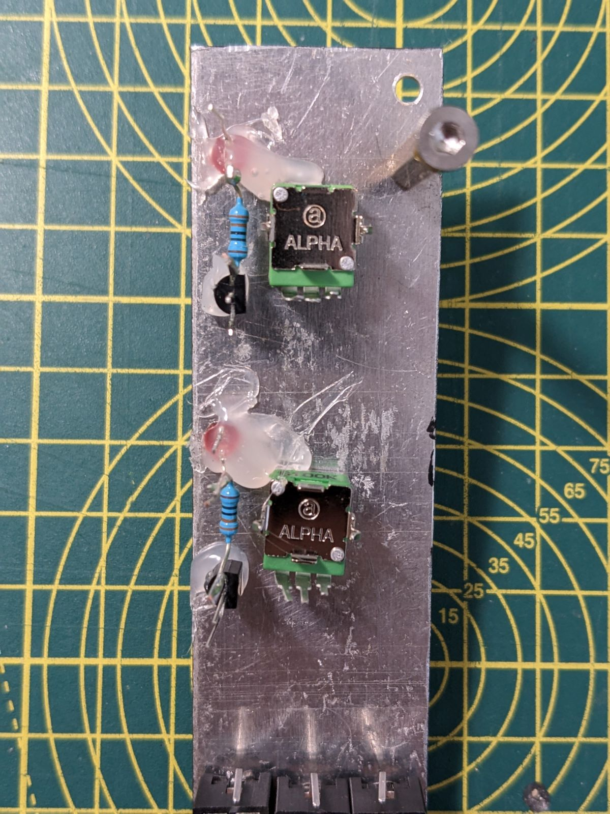
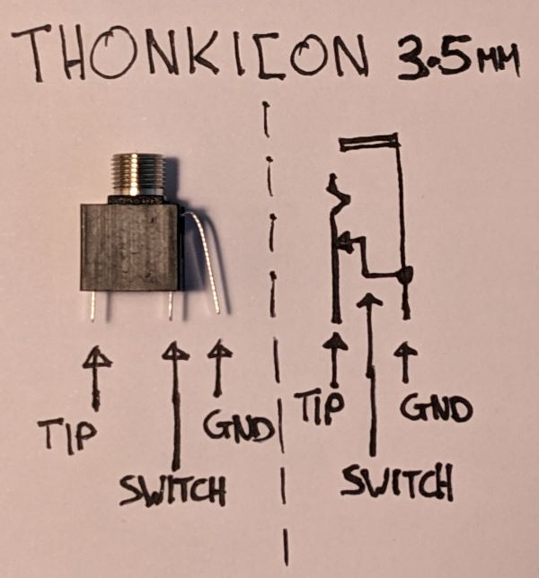

Nothing original from me here, just a stripboard version of the dual [MKI x ES EDU VCA](https://www.ericasynths.lv/shop/diy-kits-1/edu-diy-vca/), with added status LEDs on the CV inputs.

.jpg)
# Dimensions
Width: 6 HP
Depth: 40mm

The stripboard version has all the features of the original MKI x ES EDU module, two transistor based VCA's, each with a calibration trimmer pot to eliminate transistor mismatch, normalised Signal In and CV In jacks, reverse polarity protected Eurorack power input circuit with smoothing, all of which was pulled from the extensive [User Manual](https://www.ericasynths.lv/media/VCA_MANUAL_FINAL.pdf) provided on the Erica Synths sales page which details every design decision to get to this final production ready schematic. All 60 pages of documentation.. completely FREE. 

.jpg)

## Schematic of a single VCA
.jpg)

# Status LED
Seen as I had a little leftover space and can't resist blinking lights, I have added a Status LED for each of the CV Inputs. These LEDs are driven by a 2N3904 NPN whose base is driven by the raw CV In signal. I wired the base up to the CV In jack tip are the +12v & GND to the nearest potentiometer, and it worked a treat. 

# Stripboard Layout

<figure class="half">
    
    
</figure>

# Calibration

## With an Oscilloscope: 
Connect an input wave and monitor the output signal on an oscilloscope. Fiddle with the trimmer until you get the waveform’s mid-axis exactly aligned with the 0 V line

## Without an Oscilloscope: 
Online I saw a cool technique where you connect an input wave to the VCA's CV Input and headphones to the VCA output, then adjust the trimmer pots so you can no longer hear anything.

# Issues
I did run into one issue, VCA 1 never fully closes. Even though it has been calibrated there is always a low-level signal coming through it and I never really figured out why. My working theory is that either the resistors or transistors aren't well matched and that is stopping the differential amplifier from fully cancelling out the signal even when the trimmer pot is adjusted. Either that, or there is noise coming in from elsewhere in the circuit which is causing a low-level buzz. I looked online and people have mentioned this issue with various VCA kits, no one really had a solution, they just recommended that you use that VCA with CV signals rather than Audio Signals, that way it is much less noticeable that it never fully zeros. I guess if I ever build a second one then I will find out if it is a fundamental issue baked into the design, or caused by one of my specific components.

# Lessons Learned
- I was wrong about the pinout of the Thonkiconn 3.5mm Sockets in my VCO build. The long pin is the ground, not the switch!
	{: .width="200px"}
- It is super easy to create a little standalone status LED circuit using a transistor and resistor which only needs flying leads, it doesn't need to be baked into your stripboard.

***