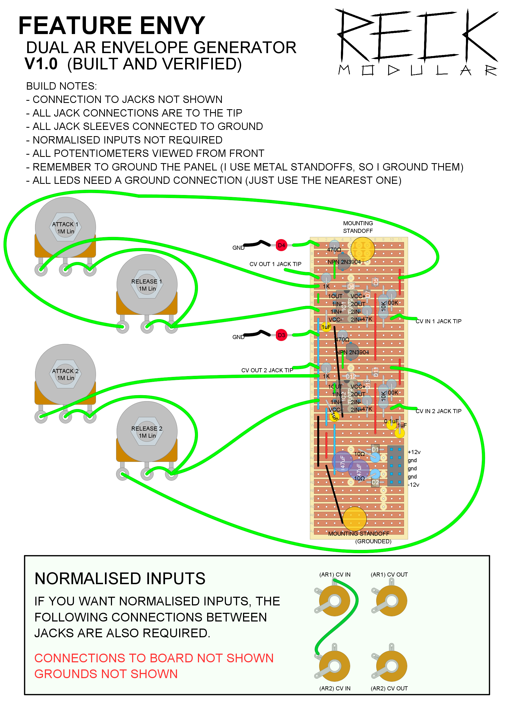
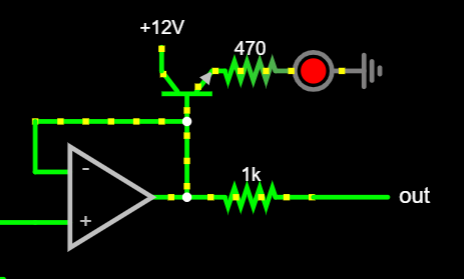
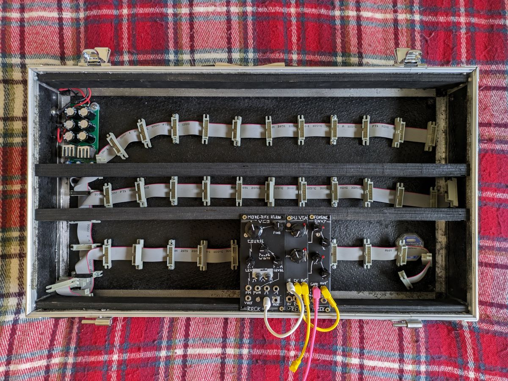

This envious little module is the ADSR Envelope stripped down to its very core, Attack, Release, and nothing more. This stupidly simple circuit consists of a single TL072 Op Amp chip, two potentiometers, and basic components. It was so small that I crammed two into this module.

.jpg)

# Dimensions

Width: 6 HP

Depth: 40mm

# Features

This dual AR envelope was based on one by Look Mum No Computer in his ['synth on a breadboard'](https://www.youtube.com/watch?v=GsTGu2V7tcU) project. I tweaked it to no longer output negative CV signals by hooking the capacitor up to ground rather than -12V, adding a pulldown resistor, and an extra diode.

Also, normalised inputs and status LEDs on the outputs!

# Schematic

The schematic for this one shows a single AR Envelope, double it to get two! Not shown is your Op Amps are powered by +12V/-12V with some 0.1uF decoupling capacitors nearby, your Gate In and CV Out are connected to the 3.5mm jack tips, and I normalised the Gate Ins of the two envelopes too.

Falstad JSCircuit Simulation can be found here: [https://tinyurl.com/23rnx7ux](https://tinyurl.com/23rnx7ux)

.png)
# Stripboard

<figure class="half">
    
    
</figure>
# Status LED Grief

It turns out 2N2222 NPN transistors don't behave the same as the 2N3904 NPN I put on the stripboard layout...sometimes (we'll get to that). Any NPN transistor should work, we're only powering an LED, and whilst I was smart enough to look up the datasheet before using this different type, that was my downfall! The datasheet says that the Emitter and Collector are swapped, but when you wire it like that it misbehaves!

What happened was that the transistor was permanently slightly open, creating a false 'out' signal which meant the envelope was constantly spitting out a 2V signal to other modules, plus the transistor was getting super hot.

I didn't know that this was the cause initially because I was lazy and didn't breadboard the design first, so it took a while to troubleshoot. First I removed the normalising between the outputs to see if I could isolate the issue to a single envelope, but that didn't help. Next, I checked all of the tracks and connections on the stripboard and they were all fine, so I looked at the capacitors because at the time of building, I didn't have any 1uF caps available and had used two 470uF caps in parallel instead. This hadn't caused issues in the past, but nothing was making sense at this point so I wanted to rule it out. Still stumped, I moved on to questioning the basic concept itself, the simulated circuit worked great but I had never actually built it on breadboard, so I set out to prove it. In the process, I realised I had run out of transistors and had to pick some up, and this is where I clocked it, "what if it is the transistors?". I opened multiple datasheets and confirmed that I hadn't read the 2N2222 pinout wrong, but chose to swap them out for some 2N3904's anyway (which I had used in a previous design and worked just fine) and alas, the problem was solved!

I used the breadboard to try to work out how to actually use the 2N2222 and the conclusion was that if I had simply chosen not to read the datasheet and installed them in the same orientation as the 2N3904 then I would have been fine, weird!

Digging deeper over the next couple of days I found [this thread](https://www.eevblog.com/forum/beginners/2n2222a-pins-are-ebc-or-cbe/) on EEVblog discussing the history of the 2N2222 and how there have been several packages all under similar names all with their pins in different orders. If the transistor you buy happens to be badly marked, it can be nearly impossible to tell which pin is which without a Transistor Tester, but I'm content with making this mystery as solved.

# Lessons Learned

- The 2N2222A NPN Transistor has a history of different pinouts all sold under the same identifier, beware!
- You should breadboard the basic concept, no matter how simple

# Rack Update

***