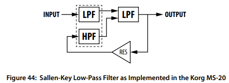
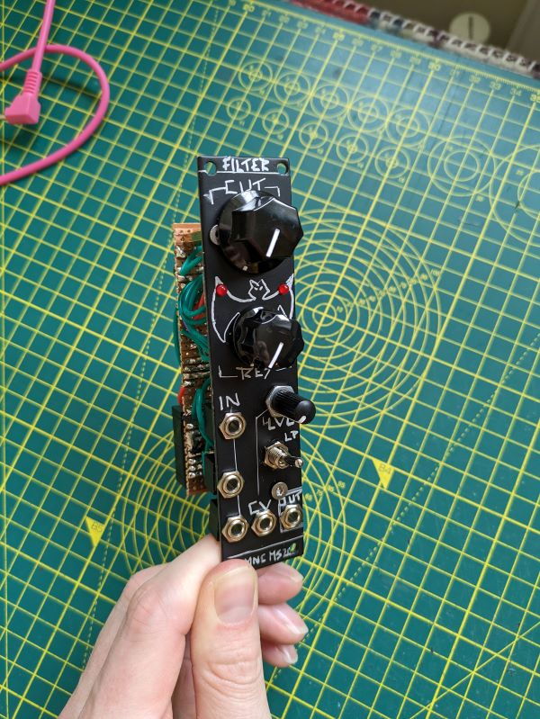
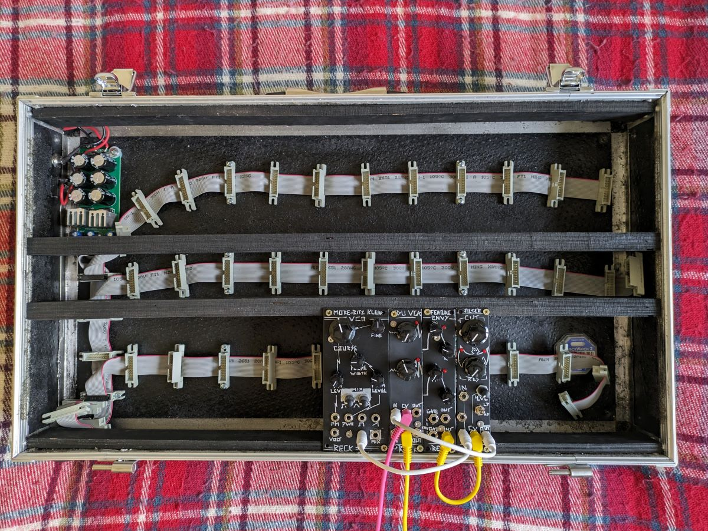

The heavy metal filter of the synth world, the MS-20 VCF is known for its harmonics and resonance the world over. This multi-mode version includes 3 inputs, Low Pass, High Pass, resonance, and CV controlled Cutoff with an adjustable attenuator.

.jpg)

# Dimensions

Width: 6 HP

Depth: 40mm

# Background

This module is a physically condensed version of [Look Mum No Computer's stripboard layout](https://www.lookmumnocomputer.com/simple-filter) of his LM13700 based version of [René Schmitz's Late Korg MS-20 Filter](https://www.schmitzbits.de/ms20.html). 

This filter is an OTA filter based on the late MS-20 LPF. As outlined by Timothy Stinchcombe in his [Study of the Korg MS10 & MS20 Fitlers](https://www.timstinchcombe.co.uk/synth/MS20_study.pdf) this is a Sallen-Key style filter, whose structure, according to [Sound Semiconductor's - Designing VC VCFs for Synths](https://www.soundsemiconductor.com/downloads/AN701.pdf), is implemented as follows:

{: .align-center}

The filtering in this circuit is performed by an Operational Transconductance Amplifier (OTA), configured as a voltage controlled 'Integrator' which is filtering the incoming signal. To add potentiometer and voltage control to this, we control the bias of the OTA towards -V and pull it back up with our potentiometer and CV signals (explanation found in Ray Wilson's book 'Make: Analog Synthesizers')

low bias = low transconductance = low cutoff frequency. high bias = high transconductance = higher cutoff frequency.

To improve the roll-off of this filter we add a 2nd filtering stage by running the signal through a buffer ('A1' in René's schematic) and then through a second filter acting as a low pass. This gives us a 2nd order filter. This signal then gets buffered again before passing to our output, plus our resonance circuit.

The resonance circuit here takes the initial abrupt signal change of something like a square wave and uses it to create a feedback loop using op amp 'A3' in René's schematic. This feedback is tamed using some diode clipping in the form of two LEDs.

# Schematic

I won't steal the schematic and post it here, you can find that on [René Schmitz's website](https://www.schmitzbits.de/ms20.html) website. There is also a note which explains how to add a switch to allow you to implement High Pass mode, which Look Mum No Computer included in [his stripboard layout](https://www.lookmumnocomputer.com/simple-filter).

To help with translating between René's CA3080 version and LMNC's LM13700 version, Eddy Bergman added the LM13700 pinout to René's schematic, [which can be found here](https://www.eddybergman.com/2019/12/synthesizer-build-part-12-korg-ms20.html?m=1).

# Stripboard

As well as condensing the original designs, I made two additional changes:

1. I swapped the 10k input resistors to 20k thanks to this ([https://lookmumnocomputer.discourse.group/t/lmnc-ms20-filter-low-output/660/54](https://lookmumnocomputer.discourse.group/t/lmnc-ms20-filter-low-output/660/54)) thread regarding how if the input signal is too hot it goes silent due to [Phase Reversal](https://northcoastsynthesis.com/news/whats-the-deal-with-phase-reversal/) on the TL074.
2. I added a 100k/47k voltage divider to the toggle switch to bring the volume of the Highpass down to a level similar to the Lowpass.

<figure class="half">
    
    
</figure>
# Lessons Learned
 - Transconductance Operational Amplifiers (OTAs) are effectively Op Amps, but the input voltages control an output current instead of an output voltage. When set up as a voltage controlled 'integrator' they can be used to create filters
- The basics of VCFs, what it means to be a 1st or 2nd order filter, and what a two-pole filter is
- What Diode Clipping is and how it can be used to tame feedback and resonance.
 - Op Amp Phase Reversal and how it can cause the signal to drop off if the input is too 'hot' [https://northcoastsynthesis.com/news/whats-the-deal-with-phase-reversal/](https://northcoastsynthesis.com/news/whats-the-deal-with-phase-reversal/)

# Rack Update

***