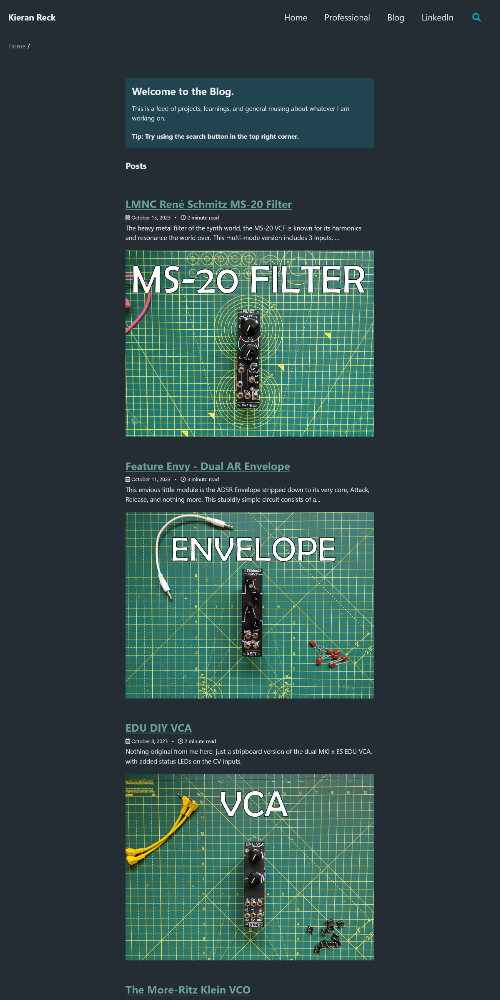

The [Minimal Mistakes Theme](https://github.com/mmistakes/minimal-mistakes) for Jekyll/Github Pages is great, but the blog view ("archive-single") only displays your posts teaser images in 'Grid View' by default. I want to change that.

# Default 'List View' Behaviour


# Improved 'List View' Behaviour
List view now shows your post's 'teaser image' in the list view



## How?

In the file `_includes/archive-single.html` you simply add the following liquid commands to the line just before `</article>` 

```markdown
 
   <div class="archive__item-teaser">
     
   </div>
 
```

and that is is.

Just in case it isn't obvious where I mean, below is a copy of my entire `_includes/archive-single.html` file:

```markdown

  {{ post.header.teaser }}

  



  

  


<div class="{{ include.type | default: 'list' }}__item">
  <article class="archive__item" itemscope itemtype="https://schema.org/CreativeWork">
    
    <div class="archive__item-teaser">
      
    </div>
    
    <h2 class="archive__item-title no_toc" itemprop="headline">
      
        <a href="{{ post.link }}">{{ title }}</a> <a href="{{ post.url | relative_url }}" rel="permalink"><i class="fas fa-link" aria-hidden="true" title="permalink"></i><span class="sr-only">Permalink</span></a>
      
        <a href="{{ post.url | relative_url }}" rel="permalink">{{ title }}</a>
      
    </h2>
    
    <p class="archive__item-excerpt" itemprop="description">{{ post.excerpt | markdownify | strip_html | truncate: 160 }}</p>
    
    <div class="archive__item-teaser">
      
    </div>
    
  </article>
</div>
```


***