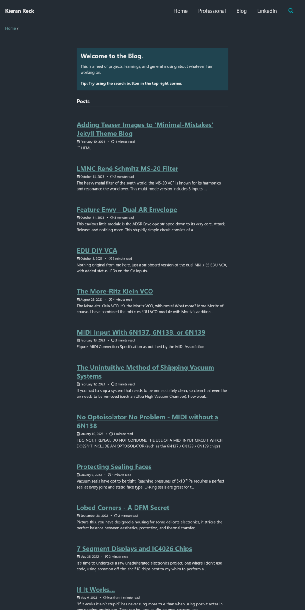

The [Minimal Mistakes Theme](https://github.com/mmistakes/minimal-mistakes) for Jekyll/Github Pages is great, hence why I used it to create this site, but it had one crutch which bugged me, **every page layout reserved space for the author profile whether you choose displayed it or not.**

In theory this is fine, you layout every page the same, with a more 'blog style' narrow width, but this ignores the fact that Minimal Mistakes comes with a class for extending your pages into the reserved space on the right, making your pages look uneven when your author profile is turned off. 



>[!warning] Image Here
>example std page  vs  wide page

This looks bad on a webpage intended to show off your portfolio, so I sought a method to fix it, with a surprising amount of success, introducing **two new layouts to the theme:**

>[!warning] Image Here showing
>Display Both New Layouts, with Titles
<figure class="half">
    <a href="/assets/images/tag_no_sidebar.jpg"></a>
    <a href="/assets/images/collection_no_sidebar.jpg"></a>
    <figcaption>`Left: tag_no_sidebar.HTML`  ||  Right: `Collection_no_Sidebar.html`</figcaption>
</figure>
# Usage Instructions
Simply call for the new layouts in the frontmatter of your page the way you usually would and away you go. These layouts pair well with `classes: wide`, giving your pages which span the full max width of your website structure, plus giving you a full width header that extends to the extremes of your monitor.

The frontmatter example below is taken straight from my [/portfolio/](/portfolio/) page:

```
---
title: Portfolio
browser_title: Portfolio \| Kieran Reck
layout: collection_no_sidebar
classes: wide
permalink: /portfolio/
collection: portfolio
entries_layout: grid
---
```

There are, however, a few background steps that you need to take before this will work:
# How to Implement
Those of you who are more html/liquid savy could probably have figured out a way to do all of this using a dedicated Class, similar to `classes: wide`, but with this being my first attempt at these languages, I couldn't figure this out. Here is how I got things to work instead:
1. Modify one of the scss partials
2. Adapt the structure in which the existing layout files call for scss partials. 

## 1. Modifying the SCSS Partials
The layout files are what dictate the order in which the content is structured, but the SCSS partials are what govern how your content is actually displayed on your site. There are two main SCSS partials which control the Minimal Mistakes theme, `_archive.scss` and `_page.scss`. 

For my solution, I chose to modify one of these,`_page.scss`, giving me the ability to choose whether I want the standard 'author profile space reserved' behaviour, or the new 'extended to fill the space' behaviour.

Here are the steps to take:
1. open up your `_sass/minimal-mistakes/_page.scss` file
2. search for any instances of `$right-sidebar-width`, at the time of writing this, there are 6 of them. Four are right near the top of the page and two are further down.
3. 'Comment out' these instances like so:
```scss
.initial-content,
.search-content {
  flex: 1 0 auto;
}

.page {
/* <------------------------------- this is where my modification starts
    @include breakpoint($large) {
      float: right;
      width: calc(100% - #{$right-sidebar-width-narrow});
      padding-right: $right-sidebar-width-narrow;
    }
  
    @include breakpoint($x-large) {
      width: calc(100% - #{$right-sidebar-width});
      padding-right: $right-sidebar-width;
    }
this is where my modification ends -------------------------------> */
  .page__inner-wrap {
    float: left;
    margin-top: 1em;
    margin-left: 0;
    margin-right: 0;
    width: 100%;
    clear: both;
  
    .page__content,
    .page__meta,
    .page__share {
      position: relative;
      float: left;
      margin-left: 0;
      margin-right: 0;
      width: 100%;
      clear: both;
    }
  }
}
```

```scss
/*
   Related
   ========================================================================== */

.page__related {
  @include clearfix();
  float: left;
  margin-top: 2em;
  padding-top: 1em;
  border-top: 1px solid $border-color;
  
/* <------------------------------- this is where my 2nd modification starts
    @include breakpoint($large) {
      float: right;
      width: calc(100% - #{$right-sidebar-width-narrow});
    }

    @include breakpoint($x-large) {
      width: calc(100% - #{$right-sidebar-width});
    }
this is where my 2nd modification ends -------------------------------> */

  a {
    color: inherit;
    text-decoration: none;
  }
}

.page__related-title {
  margin-bottom: 10px;
  font-size: $type-size-6;
  text-transform: uppercase;
}
```
4. Save the file and push your changes either via github or jekyll or whatever method you use. I use github commits.

At this point, if you have any pages in your side which rely on the `_pages.scss` partial, they will now fill to the left into the space which used to be reserved for the author profile. Neat!
{: .notice--success}
## 2. Adapting the Structure
So, we have changed our SCSS partial, but what if I still want some of my pages to reserve space for the author profile? Well, my [Contact](/contact/) page does just this!

Sadly, whilst I could figure out that it was the `_layout` files that dictated which scss partial was used for styling a page, I couldn't figure out *how* if was being done. The layout files work in a cascading fashion, each adding their few niche elements and then linking to the next layer down, with `archive.html` and `single.html` being the two 'final' destinations .


So, I took advantage of this. I created two new files, `_layouts/collection_no_sidebar.html` and  `_layouts/tag_no_sidebar.html`, which are copies of their standard brethren, and changed the frontmatter in each file so that they now called `single.html` instead of `archive.html`

Old Frontmatter within `collection_no_sidebar.html` and `tag_no_sidebar.html`
```
---
layout: archive
---
```

New Frontmatter within `collection_no_sidebar.html` and `tag_no_sidebar.html`
```
---
layout: single
---
```


This updates our structure to look like the following:

# Adding Your Own Layouts

Once you have implemented the change to `_page.scss` mentioned above, you are free to create layouts both with and without space reserved for the sidebar. It is as simple as:
1. Save a copy the Layout file you wish to use
2. Change the frontmatter of your new layout file to include one of the following:
	- With space reserved for sidebar: `layout: archive` 
	- Without space reserved for sidebar: `layout: single`
3. Call your new layout file name from within the frontmatter of the page where you want to use this style, just like you usually would!