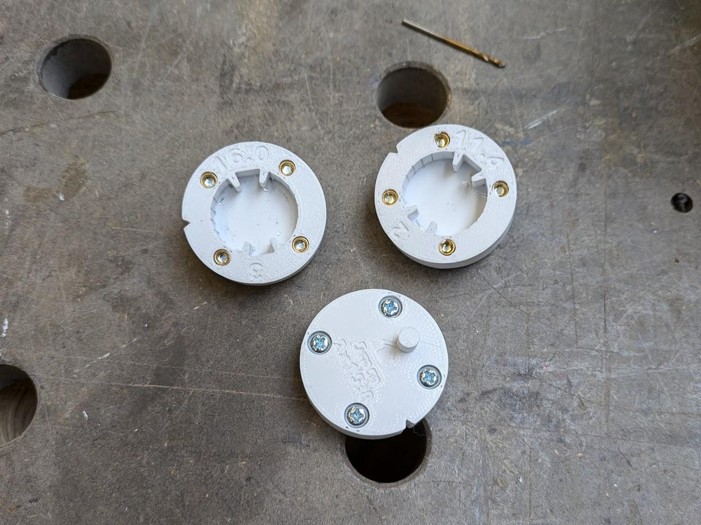

I created some quick 3D printed drilling jigs to add some tiny little 1.5mm holes to a bunch of aluminium heatsinks ready for them to be tapped at M2. The spacing here is critical because the holes I'm drilling are rather close to the edges of the heatsink. This is because it is surprisingly hard to find LED heatsinks with a diameter below 50mm, which I'm now realising is because of the spacing of the 'standard' LED Star PCB mounting holes. This same issue is the reason why I had to use M2 holes as opposed to a size which would be less likely to result in a handful of snapped drill bits. 

The alignment of the final holes wasn't perfectly placed in the heatsink, likely an error with a seam in the 3D print or something, but the consistency was great and that is what I was really after, the [LED Star Boards](https://www.ledsupply.com/leds/cree-xlamp-xpe-high-power-led-star) mount nicely!

  

# How The are Used
The order of operations is as follows:
1. Clamp a piece of scrap wood to your Pillar Drill
2. Drill a 5mm hole in the piece of wood, **from this point on, do not move the work table of your drill**
3. Swap your drill bit out for the 1.5mm
4. Place your heatsink into the jig, then place the jig into your original 5mm hole
5. Drill hole number 1
6. Pull out the heatsink, rotate 180degress, put back into jig
7. Drill hole number 2

  

# Variants
I created three different jigs, each for drilling different hole patterns, each one aligns to the original 5mm hole your drilled to ensure your holes are in the correct place
1. 1.5mm holes spaced 15.8mm apart
2. 1.5mm holes spaced 11.6mm apart
3. 2.5mm holes spaced 16.0mm apart
{: .align-center}