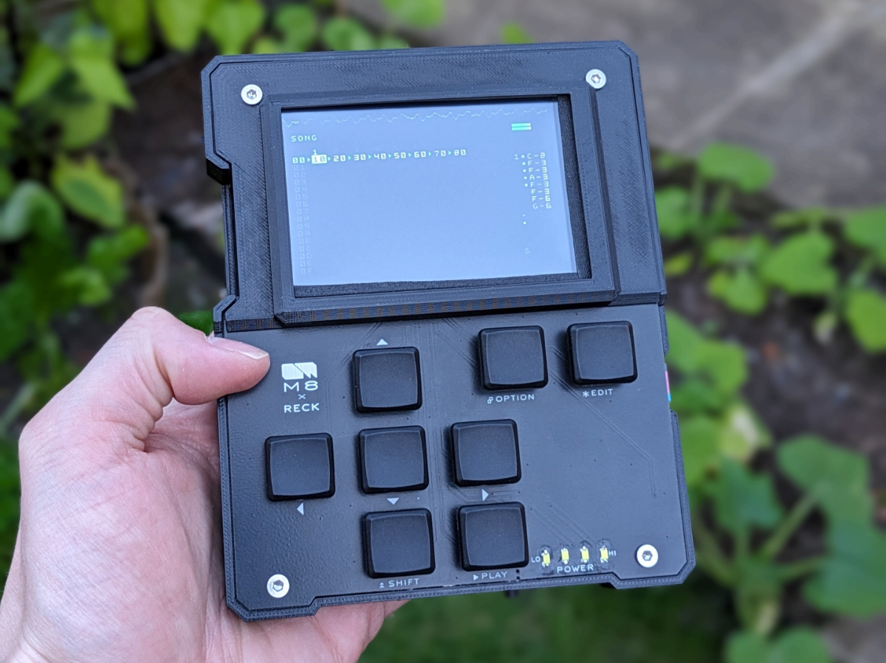{: .align-center}
I'm throwing my hat in the ring with this take on the RPi based [Headless M8 Tracker Project ](https://github.com/Dirtywave/M8HeadlessFirmware), giving my product design skills a test and taking the chance to develop my first custom PCB!
# The Features
- Fully portable with a 10000mAh battery
- USB-C charging, with the ability to seamlessly switch to running on USB power so play can continue whilst you charge.
- LED based Battery Level Meter
- Automatic shutdown at low battery levels
- Mechanical Key switches
- Access to the remaining RPi4 IO for MiDi In/out
- USB Soundcard with mono headphone and microphone connections
- Access to the SDcard for sample loading
- Protective clear plastic cover over LCD screen
# The Design
Aesthetically, I wanted this to be an ode to the original, taking design cues from the slick-but-industrial [M8 Tracker by Dirtywave](https://dirtywave.com/products/m8-tracker). I created an angular shape with visible screws and a structure which hugs the internal components. The PCB front panel exposes the copper tracks under the right light and from the side you can see the inner workings of the key switches. One last touch, a cooling vent in the back in the shape of Dirtywave's logo. The design had to be a significantly wider due to the much larger battery required to run the RPi, but even with this alternate aspect ratio it maintains it's relationship to the original.  To keep with the portable theme, I included a 1mm clearance above the screen, leaving space to add a clear Perspex covering over the delicate LCD so that you can feel comfort knowing this thing can be chucked in a bag and should survive the trip. 




# Components
All the components I used plus links to where I got them (note, i'm based in the UK):
- £35 Teensy 4.1 [amazon link](https://www.amazon.co.uk/dp/B088D3FWR7?psc=1&ref=ppx_yo2ov_dt_b_product_details)
- £ 6 3mm Thermal Gap Pad to heatsink the Teensy's main chip into the PCB [ebay link](https://www.ebay.co.uk/itm/154761641602?var=454854496977)
- £14 MicroSD 128gb Kingston Canvas Go Plus (M8's recommended) [amazon link](https://www.amazon.co.uk/dp/B088D3FWR7?psc=1&ref=ppx_yo2ov_dt_b_product_details)
- £12 MicroSD (64gb SanDisk Extreme Pro (RPi's recommendation)) [amazon link](https://www.amazon.co.uk/dp/B088D3FWR7?psc=1&ref=ppx_yo2ov_dt_b_product_details)
- £45 RPi Model4B 2GB - Purchased from Cambridge RPi shop
- £ 5 Pack of RPi heatsinks - Purchased from Cambridge RPi shop
- £27 RPi 3.5" LCD Screen (could have gotten for £20 on ebay) [amazon link](https://www.amazon.co.uk/dp/B086JPTKYV?psc=1&ref=ppx_yo2ov_dt_b_product_details)
- £ 9 UGreen USB Soundcard [amazon link](https://www.amazon.co.uk/dp/B01N905VOY?ref=ppx_yo2ov_dt_b_product_details&th=1)
- £ 6 Kailh low profile CHOC Keyswitches (10off) [link](https://mechboards.co.uk/products/kailh-low-profile-choc-switches-v1-brown)
- £ 5 MBK CHOC Keycaps (10off) [link](https://mechboards.co.uk/collections/keycaps/products/pre-order-mbk-pom-choc-keycaps?variant=40887067902157)
- £20 10000mAh LiPo [ebay link](https://www.ebay.co.uk/itm/385576096875?var=653399386016)
- £ 2 Right Angle Momentary Switch [ebay link](https://www.ebay.co.uk/itm/256347562420?var=556408431006)
	- These weren't really the best solution tbh
- £ 3 TP4056 LiPo Charging Board [ebay link](https://www.ebay.co.uk/itm/155896955375)
- £ 1 2x SB140 Schottky Diodes [ebay link](https://www.ebay.co.uk/itm/122017719610)
- £ 2 DC-DC 3v to 5V 2A Boost Stepup [ebay link](https://www.ebay.co.uk/itm/266204787802)
- £ 4 Slide Switch  - any old switch from a generic kit
- £ 4 USBC Patch Board [ebay link](https://www.ebay.co.uk/itm/404721233049)
- £ 4 Superflat 20CM USBA Left Angle to USBMicro Straight [aliexpress link](https://www.aliexpress.com/item/1005005980805607.html?spm=a2g0o.order_list.order_list_main.5.40b718024pTrxU)
- £ 4 Superflat 20CM USBA Left Angle to USBA Female Straight [aliexpress link](https://www.aliexpress.com/item/1005001459884748.html?spm=a2g0o.order_list.order_list_main.4.40b718024pTrxU)
- £15 Custom PCB + Components (5pack from [JLCPCB](https://jlcPCB.com/)
- £10 Clear Perspex LCD Covering [simplyPlastics](https://www.simplyplastics.com/catalog/sheet/cast-acrylic-sheet/clear-cast-acrylic-sheet/c-24/c-83/p-203)
- £ ? 3D Printed Housing - I used the Prusa MKI3 3D printer at work

# The Circuit
The PCB combines the circuity for the keyboard and charging/power management, and provides a convenient way to mount the usual components from these Raspberry Pi based headless projects, such as the teensy and USB Soundcard. Technically you can get the M8 working much easier way with some stripboard and cable ties (like I did in my prototype build), but once you introduce the components and circuit required for a seamless approach to battery power it gets easier to create a PCB. 

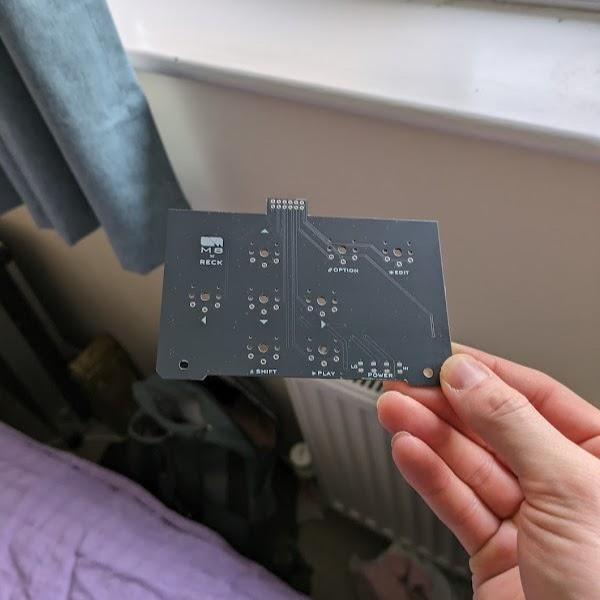
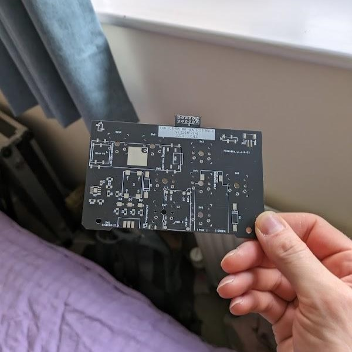

**Stripboard and Cable Tie Prototype**
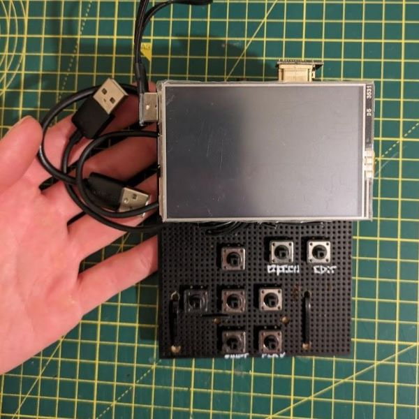

## Schematics

<div class="notice--primary">
<h4>FYI</h4>
<p>Download links for the V1 and V2 Schematic, Gerbers, and CAD can be found at the bottom of this article!</p>
</div>

_Schematic.png){: .align-center}
_PCB.png){: .align-center}
## Block Diagram
Here is the block diagram for the device:
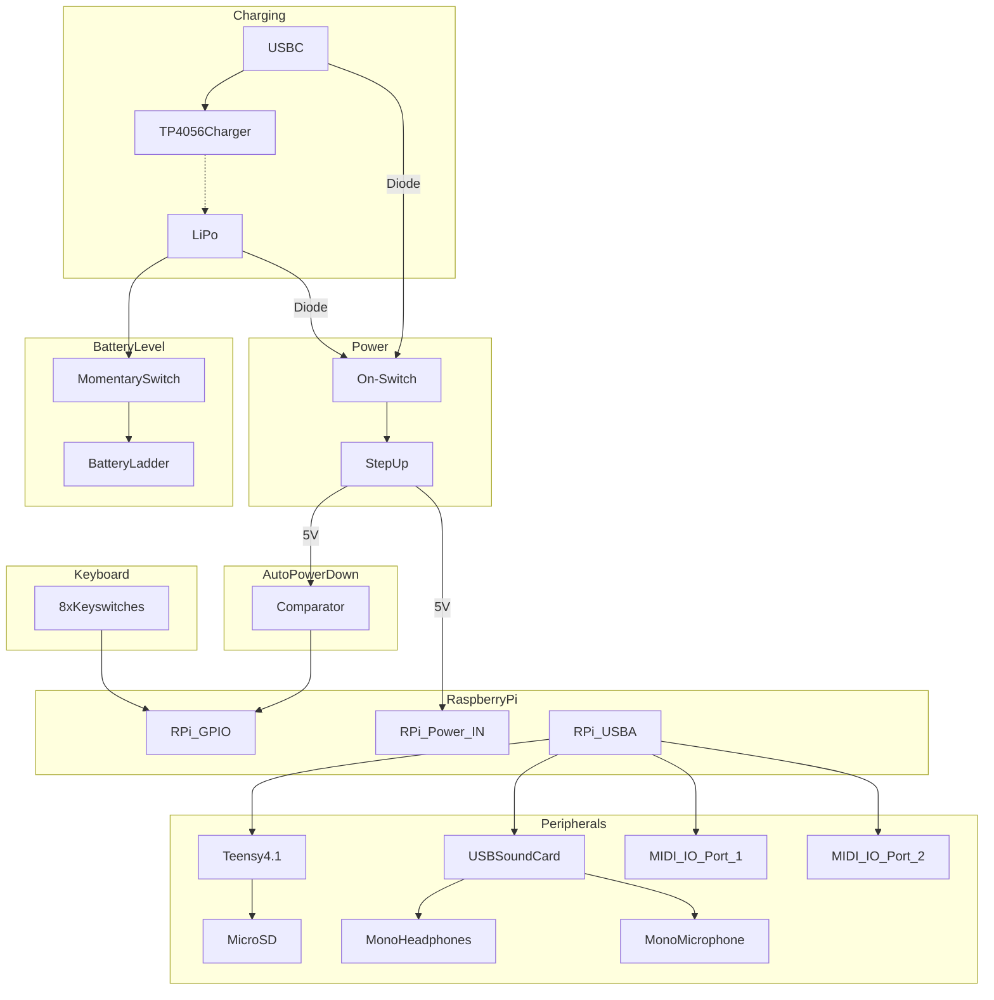
## Battery Power
Battery power is the first step to getting this device portable, but anyone who has tried to power and RPi 4 from an old battery bank knows that half of them don't work, the current draw on these things is insane. This rules out most of your typical hobby grade battery power modules which typically max out at 1A. Instead, I opted for a custom solution powering the RPi directly from a rather large (10000mAh) LiPo battery, one which is capable of handling the 3A max current draw as well the RPi's thirst for power. 

This battery power (which ranges between 3.2-4.2V) is then fed into a 2A capable 5V DC-DC Step-up module before going off to a USB-C Breakout board which is plugged into the RPi's usual power socket. 

## Charging
Going for a custom battery solution means that I need to get a little creative with the charging circuit. Ignore the output pins of the TP4056 charging module, they can only provide 1A anyway, instead we connect the battery to two places, the charger and the power circuit (via a schottky diode). 
- When the device is running off of the battery, current flows from the battery into the power circuit. 
- When a USB-C charging cable is connected, current no longer flows from the battery because the 4.2V of the battery is lower than the 5V of the USB-C. Instead, current flows from the TP4056 into the battery, charging it, and 5V flows from the USB-C to the RPi to keep it powered

This circuit seamlessly switches between battery and usb power, allowing play to continue no matter where you go.

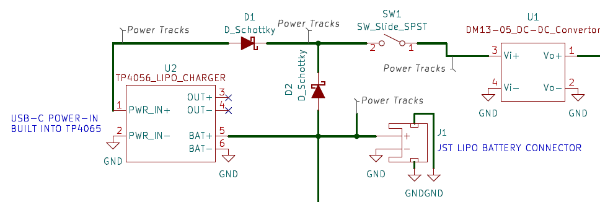{: .align-center}
## Battery Level Meter
To find out the battery level you've got two options,
1. Connect an Analog-Digital-Converter (ADC) and read it from a GPIO pin
2. Readout the voltage using hardware on the PCB

To read the battery level on the RPi you would typically connect it to an Analog-Digital-Converter (ADC) and read it from a GPIO pin. The problem is, an ADC would require 4 GPIO pins on the RPi, which I don't *easily* have space for due to the pins required for the LCD Display. That leaves us with finding a hardware way of reading it. 

I chose to try out a version of the '12V Diode Ladder', modified to work with a single cell LiPo. A 12V Diode Ladder tells you the battery reading using a string of LEDs in series, the voltage level is represented by how many LEDs light up. This circuit works for a 12V battery because each LED has a forward voltage of ~3V, so:
- 1 LEDs = -3V   = 12V Required = 25% Charge
- 2 LEDs = -6V   = 9V Required =   50% Charge
- 3 LEDs = -9V   = 6V Required =   75% Charge
- 4 LEDs = -12V = 3V Required = 100% Charge

The LiPo Diode Ladder uses the same forward voltage trick, but 3V increments don't give us enough resolution. Instead, the increments are created using a [special low forward voltage schottky diode](https://www.onsemi.com/pdf/datasheet/mbrm110l-d.pdf) (with a Vf of 0.4V). The LEDs still have a forward voltage of ~3V, so each LED's requirements are:
- LED1 - 0 Diodes = -0.0V = 3.0V Required =  25% Charge
- LED2 - 1 Diodes = -0.4V = 3.4V Required =  50% Charge
- LED3 - 2 Diodes = -0.8V = 3.8V Required =  75% Charge
- LED4 - 3 Diodes = -1.2V = 4.2V Required = 100% Charge
Although with LiPos, that the final 25% isn't usable without damaging it!
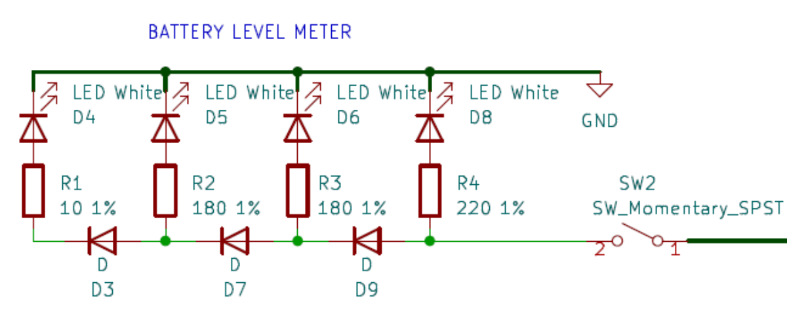{: .align-center}
<div class="notice--warning">
<h4>This Feature Doesn't Work! </h4>
<p>After all of this seemingly logical explanation, the feature doesn't actually work. All four LEDs light up even when battery is low.</p>
<p>There must be a fault in my logic somewhere, if you know what the problem is <a href="/contact/">let me know..</a>
</div>
## Low Battery Auto-Shutdown
With the battery meter being hardware based, the RPi still has no way of knowing what voltage the battery is at. This creates a problem, no matter how careful you are the battery will drain too far and either the RPi will suddenly shutdown, potentially causing corruption, or the LiPo will drain too low, permanently damaging itself. This calls for another hardware solution. 

This circuit utilises an Op Amp wired as an *Non-Inverting Schmitt Trigger*, configured to pull the output pin LOW once the battery level drops below 3.8V and not return high until it goes above 3.9V (this hysteresis ensures that it doesn't oscillate back and forth between the two). The output pin is wired into one of the RPi GPIO pins, and GPIONext (the same software used to run the keyboard) registers this as a button press and triggers a shutdown script.
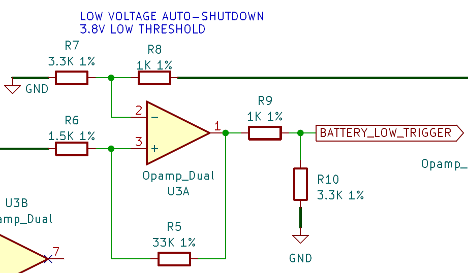{: .align-center}

<div class="notice--warning">
<h4>This Feature Doesn't Quite Work! </h4>
<p>There is a lot of voltage sag on the LiPo Battery during use, meaning that the level regularly drops below the 3.8V threshold, even though it isn't actually that low. This causes the autoshutdown to trigger, even when fully charged</p>
<p>Realistically, the solution to this is software. Creating an autoshutdown trigger which waits for the low voltage signal to last for more than 10 seconds would make this feature work.</p>
<p>For now, I haven't bothered to implement this</p>
</div>

### Programming this button in GPIOnext
For the pin to work, you need to program a `command` in GPIOnext. Bind the command to 'Pin 29', and enter the following command:
```
sleep 5 && shutdown now
```
- `sleep 5` gives the RPi time to finish processing the button press so that GPIOnext doesnt get in the way of shutdown
- `shutdown now` is pretty obvious....


There are two ways that you could go about doing this:

1. Wire a temporary button (or just short pin 29 temporarily) so that you can configure it using the built in `gpionext config` tool
2. Manually edit the sqlite database /home/pi/gpionext/config/config.db

For option 2 you would do the following:

```
cd ~/gpionext/config
sqlite3 config.db
insert into GPIOnext values(98, 'Commands', 'Low Battery', 'COMMAND', 'sleep5 && shutdown now;', '29');
```

The values in this entry are:  
- Unique ID (just pick a number that isn't used, if it is used, it will tell you in an error)  
- 'device type' (Leave as Commands),  
- 'name of command' (Low Battery),  
- 'COMMAND' (Leave this),  
- 'semi-colon separated list of commands to run' (shutdown now),  
- pin (comma separated if using multiple pins)


Now, exit sqlite3. If all went well, after a reboot you will now be able to see your command listed in the GPIOnext configurato tool under the commands section.

Huge thank you to [mholgatem](https://github.com/mholgatem), the author of GPIOnext, for the explanation of how to perform this rather non-standard implementation! Github convo found [here](https://github.com/mholgatem/GPIOnext/issues/92)
{: .notice--info} 

## Keyboard
Inspired by [ijnekenamay](https://github.com/ijnekenamay) in their [M8 Headless Staging](https://github.com/ijnekenamay/M8HeadlessStaging) project, the keyboard here is simply 8 keyswitches, each of which pull a different RPi GPIO pin LOW. This is then read by a program on the RPi called [GPIOnext](https://github.com/mholgatem/GPIOnext), which converts these presses into 'gamepad' controls which the RPi can register. 

GPIOnext can also trigger scripts, which comes in handy for adding the ability to either exit the M8 software and return to the terminal, or to run a shutdown script to safely exit the program and close down the RPi. 

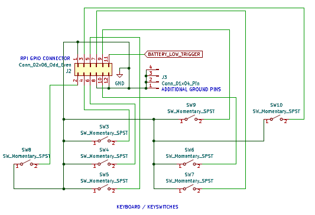{: .align-center}
## Issues with V1 PCB
When I designed V1 of the PCB, I had taken a rather optimistic approach and assumed that I would be able to solder things such as the slide switch, momentary button, and TP4056 Charging Board directly to surface mount pads, oh boy was I wrong. I knew it would be unconventional, but in reality the surface mount pads are held onto the board fairly weakly and caused me grief.

To get around this, I ended up using hot glue to hold some components in place, and soldered flying leads to earlier points in the circuit to connect the TP4056. This worked well, I should have planned to do this from the start!

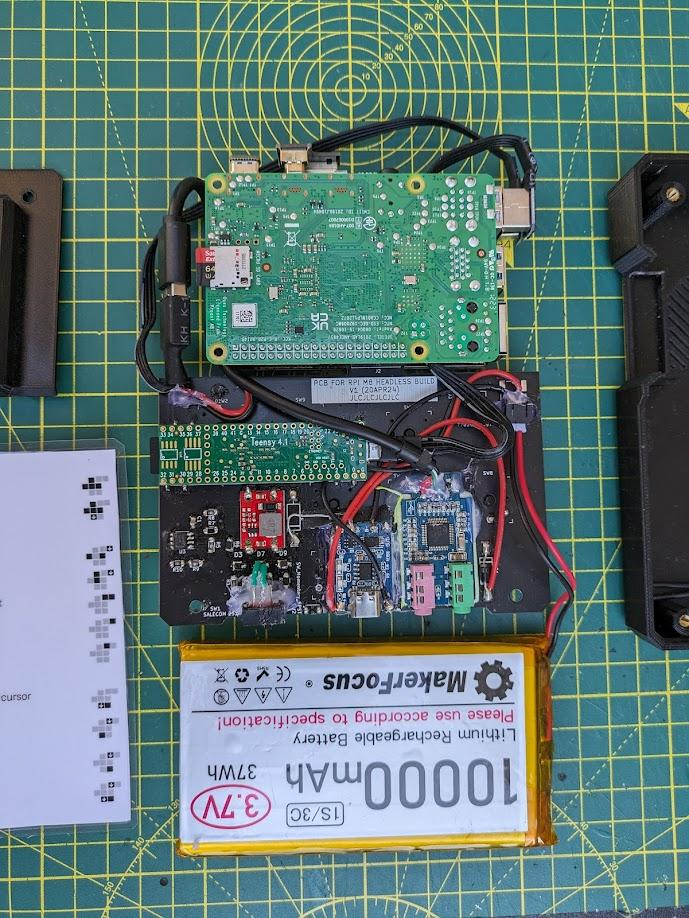{: .align-center}

It even worked for the slide switch, which I had completely mismodeled in the housing and was sitting about 10mm too low. One large pile of hot glue later and it lines up pretty well.

The other big Issue with the V1 PCB was that I hadn't expected to need to use the custom power/charging method that I describe above. Instead, I was planning on using the TP4056 in its typical configuration, with the output pins providing power to the RPi. Once I realised that this couldn't output enough current to boot the Pi I switched to the updated schematic, which was a super easy modification to the existing V1 PCB. 

### V2 - Working on battery
{: .align-center}

### V1 - Not able to power Pi on battery
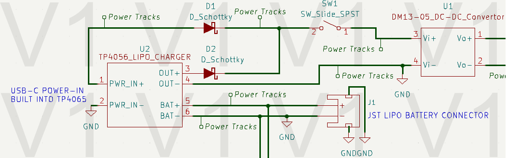{: .align-center}
# The Software
There is nothing special about my software install, I simply copied the main guides out there:
- For the Teensy, I followed the [M8 Headless Install Guide on Github](https://github.com/DirtyWave/M8Docs/blob/main/docs/M8HeadlessSetup.md) 
- For RPi I followed [RowdyVoyeur's Lego Build GitHub](https://github.com/RowdyVoyeur/m8c-rpi4), except for the controlled config using GPIOnext, which is ripped from [Ijnekenamay's PCB Build GitHub](https://github.com/ijnekenamay/M8HeadlessStaging) 
	- The only addition for the GPIOnext config was my additional auto-shutdown comparator signal, which I explained earlier in the article.

# Conclusion
I'm happy with how the project came out, even if I wouldn't recommend others building it unless they are willing to do some DIY. The V1 PCB wasn't perfect and took a bit of jank to fix , but I've got to admit it looks damn good! Plus, I finally took the leap to learn how to make PCB's and it worked first time, even if my circuit did have mistakes. 

Great project, I'm super excited to play this thing!

# Files

<div class="notice--warning">
<h3>If you plan on copying this project...</h3>
<p>Using the files below, you've got two options really:</p>
<p>1. Use the V1 PCB and modify it like I did (I have 4 of these spare, hit me up on my <a href="/contact/">Contact Page</a> if you are interested and I'll post one over</p>
<p>2. Use the V2 PCB files, but note that I never actually used them myself so I haven't tested that everything is cool.
<p><b>If you do make a version of this, <a href="/contact/">let me know!</a></b></p>
</div>
## CAD for V1


## PCB V1
Requires the mods made in V2


.zip)
## PCB V2
.pdf)

.zip)
