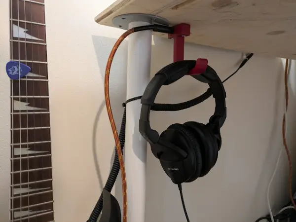
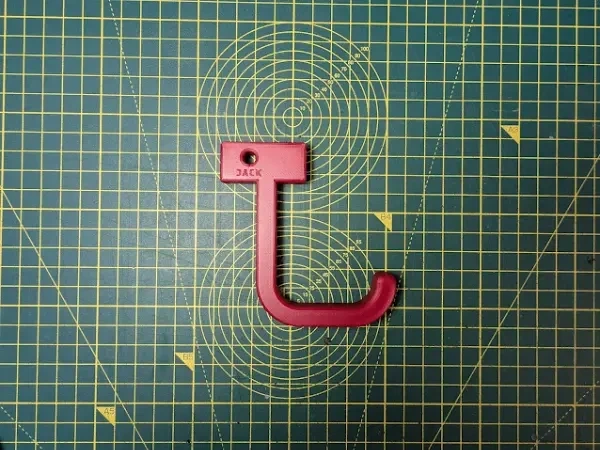

I designed a headphone hook which also provides a place to plug my guitar cable when it isn't in use. 
{: .align-center}

No more will I have to deal with a cable wrapped around my chair, there shall be order!



## Print-In-Place Spring
I tried to get a little clever with this design by adding a print in place spring, one which mimic's the retention mechanism of a guitar jack and would hold the jack securely in place. 

Ultimately, the spring was a failure. It was too thin and weak to actually impart any force and instead the jack is simply being held by the snug diameter of the hole.

But still, look how cool it could have been:



{: .align-center}