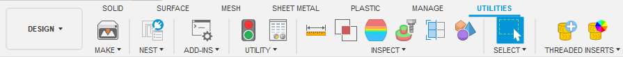

A vibe coded Autodesk Fusion / Fusion360 add-in for managing threaded insert workflows. This tool helps teams identify and mark threaded insert holes using unique diameter parameters and applying a visual appearance.

{: .align-center}

<video width="100%" autoplay loop muted>
    <source src="../assets/images/fusion360-threadedinserts-addin-DemoVideo.mp4" type="video/mp4">
    Your browser does not support the videos.
</video>

For more info, visit the project's GitHub: [https://github.com/KieranReck/fusion360-threadedinserts-addin](https://github.com/KieranReck/fusion360-threadedinserts-addin)
{: .notice--success}

***