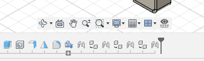

A vibe coded Autodesk Fusion / Fusion360 add in which allows you to toggle sketch visibility from a timeline or viewport selection

<video width="100%" autoplay loop muted>
    <source src="../assets/images/fusion360-TimelineSketchVisibilityToggle-DemoVideo.webm" type="video/webm">
    Your browser does not support the videos.
</video>

## Overview
Gone are the days of scrolling through long lists of sketches in the browser folder to toggle visibility, this add-in provides two new functions:
1. **Toggle Selected Sketch's Visibility From the Timeline**
    - Select sketch(s) within on the timeline and toggle their visibility on/off (no visit to the browser folder required) 
2. **Toggle Selected Sketch's Visibility From the Viewport**
    - Select a sketch line/circle/arc within the viewport and toggle the parent sketch's visibility on/off
3. **Bonus - Toggle Selected Sketch's Visitility From the Browser**
    - This tool can also toggle sketches from the browser, replicating the functionality of fusion's built in visibility toggle

All functions are achieved through the same action, for which a button (  ) is added to the Navigation Toolbar at the bottom of the viewport window:

 

A keyboard Shortcut can also be added, albeit through a slightly different method to the usual process (method detailed under 'Usage') 

For more info, visit the project's GitHub: [https://github.com/KieranReck/fusion360-timelinesketchvisibilitytoggle-addin/tree/main](https://github.com/KieranReck/fusion360-timelinesketchvisibilitytoggle-addin/tree/main)
{: .notice--success}
