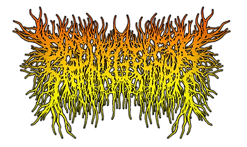

In [Rob Scallon's Video with the band Peeling Flesh](https://www.youtube.com/watch?v=BbzklIdT-bk) they talk about how the 'Slam' genre comes out of a self aware 'horror comedy' approach to death metal. It's taking the sterotypes of death metal bands and turning them into a characature. The vocals are even less intelegable, the riffs are grosser, and the logo is absolutely impossible to read.

{: .align-center}

It got me wanting to make my own logo.

I searched online, surly there is a death metal logo generator somewhere? Turns out that since AI images became a thing the only logo generators you can find are AI slop machines. Lets DIY this shix!

**Step 1: Find a brutal font**

This one is literally called ROSE THORNS! [https://online-fonts.com/fonts/rose-thorns](https://online-fonts.com/fonts/rose-thorns)

{: .align-center}

**Step 2: Import it to Inkscape**

**Step 3: Write out each of your letters individually**

R   E   C   K

**Step 4: Convert to Path**

**Step 5: Use Path Effects to add stank to that font**

Lattice Deformation for the shape. Pull individual nodes for the texture.

**Step 6: Rock out**

>

Why stop there? This would look sick engraved onto my headphones

{: .align-center}